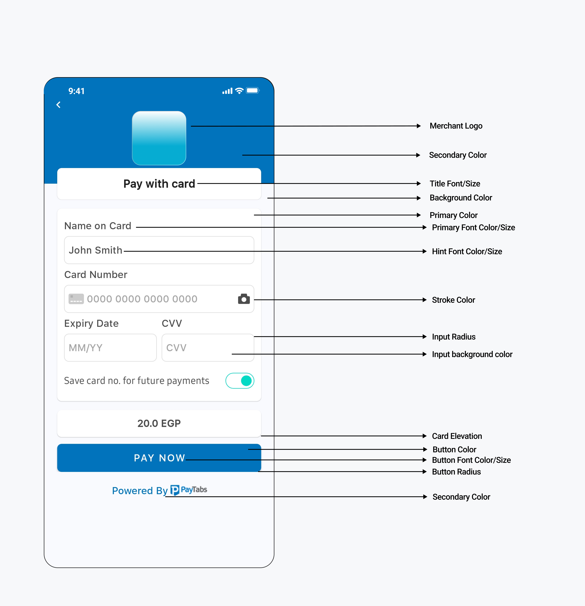

# PayTabs Android Library Sample

## Installation

### Requirements

- Minimum Java 8 or Android 5.1
- `targetSdk` and `compileSdk` should be set to 34.

Include the following dependency in your project:

```groovy
implementation 'com.paytabs:payment-sdk:6.6.5'
```

### Known Coroutine Issue

If you encounter a "Duplicated class" dependency conflict with the coroutine API, add the following to your app's Gradle file:

```groovy
configurations.all {
    resolutionStrategy {
        exclude group: "org.jetbrains.kotlinx", module: "kotlinx-coroutines-debug"
    }
}
```

## ProGuard Configuration

If you are using ProGuard, you may need to exclude the library classes:

```text
-keep public class com.payment.paymentsdk.**{*;}
```

## Pay Now (Kotlin)

### Example Usage

```kotlin
val profileId = "PROFILE_ID"
val serverKey = "SERVER_KEY"
val clientKey = "CLIENT_KEY"
val locale = PaymentSdkLanguageCode.EN or PaymentSdkLanguageCode.AR
val screenTitle = "Test SDK"
val cartId = "123456"
val cartDesc = "Cart description"
val currency = "AED"
val amount = 20.0

val tokeniseType = PaymentSdkTokenise.NONE
// Options: 
// PaymentSdkTokenise.USER_OPTIONAL 
// PaymentSdkTokenise.USER_MANDATORY 
// PaymentSdkTokenise.MERCHANT_MANDATORY 
// PaymentSdkTokenise.USER_OPTIONAL_DEFAULT_ON 

val transType = PaymentSdkTransactionType.SALE
// or PaymentSdkTransactionType.AUTH
// or PaymentSdkTransactionType.REGISTER

val tokenFormat = PaymentSdkTokenFormat.Hex32Format()
// Options: 
// PaymentSdkTokenFormat.NoneFormat 
// PaymentSdkTokenFormat.AlphaNum20Format 
// PaymentSdkTokenFormat.Digit22Format 
// PaymentSdkTokenFormat.Digit16Format 
// PaymentSdkTokenFormat.AlphaNum32Format 

val billingData = PaymentSdkBillingDetails(
    "City",
    "2-digit ISO country code",
    "email1@domain.com",
    "Name",
    "Phone", 
    "State",
    "Address street", 
    "ZIP"
)

val shippingData = PaymentSdkShippingDetails(
    "City",
    "2-digit ISO country code",
    "email1@domain.com",
    "Name",
    "Phone", 
    "State",
    "Address street", 
    "ZIP"
)

val configData = PaymentSdkConfigBuilder(profileId, serverKey, clientKey, amount ?: 0.0, currency)
    .setCartDescription(cartDesc)
    .setLanguageCode(locale)
    .setMerchantIcon(resources.getDrawable(R.drawable.bt_ic_amex))
    .setBillingData(billingData)
    .setMerchantCountryCode("AE") // ISO Alpha-2 code
    .setShippingData(shippingData)
    .setCartId(cartId)
    .setTransactionType(transType)
    .showBillingInfo(false)
    .showShippingInfo(true)
    .forceShippingInfo(true)
    .setScreenTitle(screenTitle)
    .isDigitalProduct(false)
    .build()

startCardPayment(this, configData, callback = this)
// or 
startSamsungPayment(this, configData, "samsungpay token", callback = this)

override fun onError(error: PaymentSdkError) {
    Log.d(TAG_PAYTABS, "onError: $error")
    Toast.makeText(this, "${error.msg}", Toast.LENGTH_SHORT).show()
}

override fun onPaymentFinish(paymentSdkTransactionDetails: PaymentSdkTransactionDetails) {
    Toast.makeText(
        this,
        "${paymentSdkTransactionDetails.paymentResult?.responseMessage}",
        Toast.LENGTH_SHORT
    ).show()
    Log.d(TAG_PAYTABS, "onPaymentFinish: $paymentSdkTransactionDetails")
}

override fun onPaymentCancel() {
    Toast.makeText(this, "Cancelled", Toast.LENGTH_SHORT).show()
    Log.d(TAG_PAYTABS, "onPaymentCancel:")
}
```

### Setting Expiry Timeout for the Card Payment Screen

```kotlin
/** To set a timeout of 2 minutes (120 seconds).
 * Set to 0 to deactivate the timeout feature.
 * The expiryTime cannot be set to less than 60 seconds.
 */
configuration.setPaymentExpiry(120)
```

### Closing the Payment Screen

To close the payment screen if there are no ongoing transactions:

```kotlin
PaymentSdkActivity.cancelPayment()
```

### Starting the Payment Process

1. **Normal Card Payment:**

```kotlin
startCardPayment(context = this, ptConfigData = configData, callback = this)
```


2. **Recurring Payment:**

```kotlin
startTokenizedCardPayment(
    context = this,
    ptConfigData = configData,
    token = yourToken,
    transactionRef = yourTransactionReference,
    callback = this)
```

3. **Recurring Payment with 3DS Feature Enabled (Request CVV):**

```kotlin
start3DSecureTokenizedCardPayment(
    context = this,
    ptConfigData = configData,
    savedCardInfo = PaymentSDKSavedCardInfo("Masked card", "Visa or MC or card type"),
    token = token!!,
    callback = this)
```


4. **Recurring Payment with Saved Cards:**

```kotlin
startPaymentWithSavedCards(
    context = this, 
    ptConfigData = configData,
    support3DS = true,
    callback = this)
```


## Querying Transaction Status

1. **Create a Query Configuration:**

```kotlin
val queryConfig = PaymentSDKQueryConfiguration(
    "ServerKey",
    "ClientKey",
    "Country ISO 2",
    "Profile Id",
    "Transaction Reference"
)
```

2. **Execute the Query:**

```kotlin
QuerySdkActivity.queryTransaction(
    this,
    queryConfig,
    this
)
```

## Pay Now (Java)

### Example Usage

```java
String profileId = "PROFILE_ID";
String serverKey = "SERVER_KEY";
String clientKey = "CLIENT_KEY";
PaymentSdkLanguageCode locale = PaymentSdkLanguageCode.EN;
String screenTitle = "Test SDK";
String cartId = "123456";
String cartDesc = "Cart description";
String currency = "AED";
double amount = 20.0;

PaymentSdkTokenise tokeniseType = PaymentSdkTokenise.NONE;
// Options:
// PaymentSdkTokenise.USER_OPTIONAL 
// PaymentSdkTokenise.USER_MANDATORY 
// PaymentSdkTokenise.MERCHANT_MANDATORY

PaymentSdkTransactionType transType = PaymentSdkTransactionType.SALE;
// or PaymentSdkTransactionType.AUTH
// or PaymentSdkTransactionType.REGISTER

PaymentSdkTokenFormat tokenFormat = new PaymentSdkTokenFormat.Hex32Format();
// Options:
// new PaymentSdkTokenFormat.NoneFormat() 
// new PaymentSdkTokenFormat.AlphaNum20Format() 
// new PaymentSdkTokenFormat.Digit22Format()
// new PaymentSdkTokenFormat.Digit16Format()
// new PaymentSdkTokenFormat.AlphaNum32Format()

PaymentSdkBillingDetails billingData = new PaymentSdkBillingDetails(
    "City",
    "2-digit ISO country code",
    "email1@domain.com",
    "Name",
    "Phone", 
    "State",
    "Address street", 
    "ZIP"
);

PaymentSdkShippingDetails shippingData = new PaymentSdkShippingDetails(
    "City",
    "2-digit ISO country code",
    "email1@domain.com",
    "Name",
    "Phone", 
    "State",
    "Address street", 
    "ZIP"
);

PaymentSdkConfigurationDetails configData = new PaymentSdkConfigBuilder(profileId, serverKey, clientKey, amount, currency)
    .setCartDescription(cartDesc)
    .setLanguageCode(locale)
    .setBillingData(billingData)
    .setMerchantCountryCode("AE") // ISO Alpha-2 code
    .setShippingData(shippingData)
    .setCartId(cartId)
    .setTransactionType(transType)
    .showBillingInfo(false)
    .showShippingInfo(true)
    .forceShippingInfo(true)
    .setScreenTitle(screenTitle)
    .build();

PaymentSdkActivity.startCardPayment(this, configData, this);

@Override
public void onError(@NotNull PaymentSdkError paymentSdkError) {
    // Handle error
}

@Override
public void onPaymentCancel() {
    // Handle cancellation
}

@Override
public void onPaymentFinish(@NotNull PaymentSdkTransactionDetails paymentSdkTransactionDetails) {
    // Handle payment completion
}
```

### Starting the Payment Process

1. **Normal Card Payment:**

```java
PaymentSdkActivity.startCardPayment(
    this,
    configData,
    this);
```

2. **Recurring Payment:**

```java
PaymentSdkActivity.startTokenizedCardPayment(
    this,
    configData,
    "Token",
    "TransactionRef",
    this);
```

3. **Recurring Payment with 3DS Feature Enabled (Request CVV):

**

```java
PaymentSdkActivity.start3DSecureTokenizedCardPayment(
    this,
    configData,
    new PaymentSDKSavedCardInfo("Masked card", "Visa or MC or card type"),
    "Token",
    this);
```

4. **Recurring Payment with Saved Cards:**

```java
PaymentSdkActivity.startPaymentWithSavedCards(
    this,
    configData,
    true,
    this);
```

## Handling Transaction Response

You can use `paymentSdkTransactionDetails?.isSuccess` to ensure a successful transaction. If the transaction is not successful, you should check the corresponding failure code, which you will receive in `paymentSdkTransactionDetails?.paymentResult?.responseCode`. All codes can be found in the [Payment Response Codes](https://site.paytabs.com/en/pt2-documentation/testing/payment-response-codes/).

## Tokenization

To enable tokenization, follow the instructions below:

```kotlin
// Request token and transaction reference by passing tokeniseType and Format
setTokenise(PaymentSdkTokenise.MERCHANT_MANDATORY, PaymentSdkTokenFormat.Hex32Format()) 
// You will receive token and reference after the first transaction       
// Pass the token and transaction reference returned from the SDK
.setTokenisationData(token = "", transactionReference = "") 
```

## Card Approval

The Payment SDK allows you to customize BIN-based discounts through the `PaymentSdkCardApproval` class, which collects approval details via an API.

### Example Usage

```kotlin
val cardApproval = PaymentSdkCardApproval(
    validationUrl = "Your validation URL. Ex: https://yourdomain.com/validate",
    binLength = 8,
    blockIfNoResponse = false
)

val configData = PaymentSdkConfigBuilder(profileId, serverKey, clientKey, amount ?: 0.0, currency)
    .setCardApproval(cardApproval)
    .build()
```

- **`validationUrl`**: The endpoint provided by the business where the Payment SDK will pass transaction information and receive a response.
- **`binLength`**: The length of the BIN (default is 6 digits, can be set to 8).
- **`blockIfNoResponse`**: Determines whether to block the transaction if there is no response from the validation endpoint.

## Card Discount

To apply a discount on a card payment, use the following method:

```kotlin
// List of card discounts
val cardDiscount = listOf(
    PaymentSdkCardDiscount(
        // List of card prefixes from 4 to 10 digits
        listOf("40001"),
        // Discount percentage or value
        10.0,
        // Discount description
        "● 10% discount on VISA cards starting with 40001",
        // Discount type: percentage or value
        true
    )
)
...setCardDiscount(cardDiscount)
```

## Samsung Pay

1. To enable payments with Samsung Pay, first integrate with the Samsung Pay API. Follow the [Samsung Pay Integration Guide](https://github.com/paytabscom/paytabs-android-library-sample/blob/master/samsung_pay.md).

2. Pass the returned JSON token from Samsung Pay to the following method:

```kotlin
startSamsungPayment(this, configData, "samsungpay token", callback = this)
```

## Overriding Resources

### Overriding Fonts

Add your custom font files with the following names:

- `payment_sdk_primary_font.tff`
- `payment_sdk_secondary_font.tff`

### Overriding Strings, Colors, or Dimens

To override strings, colors, or dimens, add the resource you need to override from the resources below:



#### Example of Overriding Colors and Dimens:

```xml
<resources>
    <!-- Override colors -->
    <color name="payment_sdk_primary_color">#000000</color>
    <color name="payment_sdk_secondary_color">#1B1B1B</color>
    <color name="payment_sdk_background_color">#292929</color>
    <color name="payment_sdk_button_background_color">#45444A</color>
    <color name="payment_sdk_input_field_background_color">#8E8E8D</color>
    <color name="payment_sdk_stroke_color">#90918F</color>
    <color name="payment_sdk_title_text_color">#FFFFFF</color>
    <color name="payment_sdk_primary_font_color">#FFFFFF</color>
    <color name="payment_sdk_secondary_font_color">#0094F1</color>
    <color name="payment_sdk_button_text_color">#FFF</color>
    <color name="payment_sdk_hint_font_color">#D8D8D8</color>
    <color name="payment_sdk_error_text_color">#650303</color>
    <color name="payment_sdk_back_black_dim">#4D6E6E6E</color>
    <color name="payment_sdk_status_bar_color">#444647</color>

    <!-- Override dimens -->
    <dimen name="payment_sdk_primary_font_size">17sp</dimen>
    <dimen name="payment_sdk_secondary_font_size">15sp</dimen>
    <dimen name="payment_sdk_separator_thickness">1dp</dimen>
    <dimen name="payment_sdk_stroke_thickness">.5dp</dimen>
    <dimen name="payment_sdk_input_corner_radius">8dp</dimen>
    <dimen name="payment_sdk_button_corner_radius">8dp</dimen>
</resources>
```

### Overriding Strings

You can find the keys with the default values here:

- [English Strings](https://github.com/paytabscom/paytabs-android-library-sample/blob/master/res/strings.xml)
- [Arabic Strings](https://github.com/paytabscom/paytabs-android-library-sample/blob/master/res/strings-ar.xml)

### Overriding Drawables

To override the back button icon, add your drawable file with the name:

```text
payment_sdk_back_arrow.xml
```

## Common Issues

For a list of common issues, refer to [Common Issues](https://github.com/paytabscom/paytabs-android-library-sample/blob/master/common_issues.md).

## License

For licensing information, see [License](https://github.com/paytabscom/paytabs-android-library-sample/blob/master/LICENSE).

## PayTabs

[Support](https://support.paytabs.com) | [Terms of Use](https://www.paytabs.com/en/terms-of-use/) | [Privacy Policy](https://www.paytabs.com/en/privacy-policy/)
